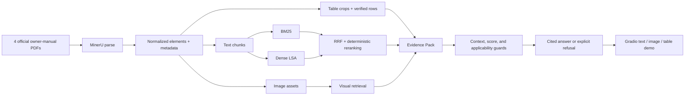
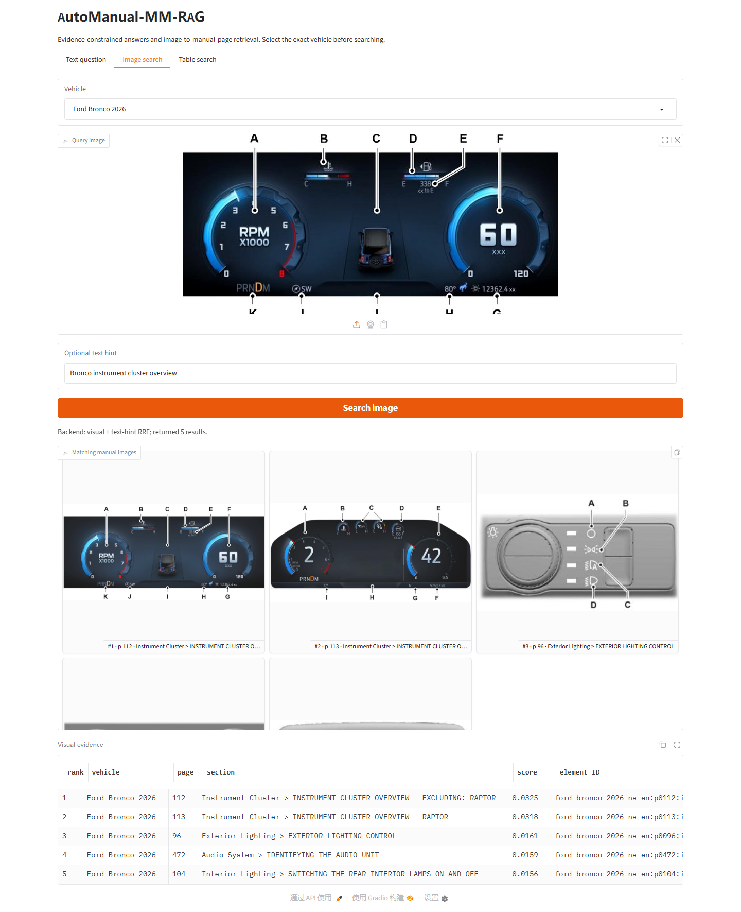

# AutoManual-MM-RAG

Traceable multimodal retrieval over official automotive owner manuals. The
current stage provides a verified Ford 2026 North American English corpus,
MinerU output normalization, evidence-preserving JSONL, and auditable
BM25/Dense/RRF text baselines, traditional visual retrieval, and an
evidence-constrained extractive answer/demo layer.

## Architecture



## Current corpus stage

Four official Ford manuals have been parsed locally with MinerU 3.4.4
(`pipeline` + `txt`). The large PDFs, MinerU JSON, extracted assets, and
normalized JSONL are intentionally ignored by Git.

Authoritative document metadata and source URLs live in
`data/manifests/corpus.csv`. MinerU's native zero-based `page_idx` is exposed as
a one-based physical PDF `page_no`. Printed manual page labels remain available
in `source_locator.source_page_label`.

Normalize all four manuals and fail if a page, asset, or source field is
invalid:

```powershell
python .\scripts\import_mineru_output.py --strict
```

The command writes:

```text
data/processed/
├── import_summary.json
└── <doc_id>/elements.jsonl
```

Each JSONL record contains stable document-scoped evidence metadata, section
path, normalized `text|table|image` type, content, asset path, bbox, adjacent
element IDs, and a native MinerU source locator. Images and tables also carry
their caption/footnote when present plus nearest same-page text. No VLM calls
are made during import.

The importer, chunker, and BM25 core use the Python standard library. Install
the retrieval and visual extras before running the complete 38-test suite:

```powershell
python -m pip install -r .\requirements-retrieval.txt
python -m pip install -r .\requirements-visual.txt
python -m unittest discover -s tests -v
```

If optional dependencies are missing, their tests are reported as skipped;
the complete verification run should finish with no skipped tests.

The verified local import currently contains:

| Document | Text | Image | Table | Missing page | Invalid asset | Anomaly |
|---|---:|---:|---:|---:|---:|---:|
| Ford Bronco 2026 | 7,752 | 899 | 143 | 0 | 0 | 0 |
| Ford F-150 Lightning 2026 | 9,013 | 945 | 144 | 0 | 0 | 0 |
| Ford Mustang Mach-E 2026 | 6,270 | 665 | 107 | 0 | 0 | 0 |
| Ford Maverick 2026 | 7,096 | 778 | 122 | 0 | 0 | 0 |
| **Total** | **30,131** | **3,287** | **516** | **0** | **0** | **0** |

See `reports/mineru_quality_report.md` for the 12-page visual spot check and
known limitations. In particular, table recognition was disabled for this
fast parse: all 516 table elements have valid crop images, but no structured
cell HTML. Only pages needed for table QA should be selectively re-parsed
later.

## Text chunks and retrieval baselines

Build section-aware retrieval chunks after normalization:

```powershell
python .\scripts\build_chunks.py
```

The builder does not cross PDF page or section boundaries. Numbered operations
remain in source order, while Warning, Caution, and Note blocks are standalone
chunks. Titles are represented in `section_path` instead of duplicated in the
body. The current corpus produces 12,236 chunks:

| Chunk type | Count |
|---|---:|
| Regular text | 6,086 |
| Ordered steps | 1,400 |
| Warning | 1,648 |
| Caution | 2 |
| Note | 3,100 |

Build the dependency-free SQLite FTS5 BM25 index:

```powershell
python .\scripts\build_bm25_index.py
```

Search with pre-retrieval metadata hard filters:

```powershell
python .\scripts\search_bm25.py `
  "How do I adjust the steering wheel?" `
  --model "Bronco" `
  --year 2026
```

Evaluate against the 30-question Gold Evidence set:

```powershell
python .\scripts\evaluate_bm25.py
```

Current BM25-only results over 26 answerable questions are:

| Metric | Result |
|---|---:|
| Recall@5 | 0.8846 |
| Recall@10 | 0.9615 |
| MRR@10 | 0.7991 |
| Metadata filter violations | 0 |

The four no-answer questions are diagnostic only and are excluded from
retrieval recall. BM25 currently returns candidates for all four because an
abstention threshold has not been added. See
`reports/bm25_baseline.md` and
`outputs/metrics/bm25_baseline.json` for category-level results and individual
ranks.

The local Dense baseline uses 2,048 hashed TF-IDF features and deterministic
randomized LSA to produce 128-dimensional vectors. It requires NumPy but does
not download a model:

```powershell
python -m pip install -r .\requirements-retrieval.txt
python .\scripts\build_dense_index.py
```

This is an offline latent-semantic baseline, **not** a neural embedding model.
Its pickle-free index is written to ignored
`data/indexes/dense_lsa.npz`. Search Dense or the default BM25/Dense RRF
fusion with the same metadata hard filters:

```powershell
python .\scripts\search_retrieval.py `
  "How do I adjust the steering wheel?" `
  --backend hybrid `
  --model "Bronco" `
  --year 2026
```

Rebuild Dense, evaluate BM25/Dense/RRF on the same Gold set, and audit index
and RRF provenance with one command:

```powershell
python .\scripts\run_retrieval_comparison.py
```

Current fixed-parameter results are:

| Backend | Recall@5 | Recall@10 | MRR@10 | Metadata violations |
|---|---:|---:|---:|---:|
| BM25-only | **0.8846** | **0.9615** | **0.7991** | 0 |
| Dense LSA-only | 0.7692 | 0.7692 | 0.5833 | 0 |
| BM25 + Dense RRF | 0.8077 | 0.8846 | 0.7475 | 0 |

RRF uses top-50 candidates, `k=60`, and equal backend weights. It did not
improve over BM25 on this evaluation set; no Gold-driven tuning was applied.
The audit passed with a `[12236, 128]` vector matrix, zero chunk/metadata
mismatches, and zero rank/score/formula/filter violations across 300 fused
results. See `reports/retrieval_comparison.md` and
`outputs/metrics/retrieval_audit.json`.

## Visual retrieval MVP

The 3,803 MinerU JPG resources resolve exactly to 3,287 normalized `image`
elements and 516 normalized `table` crops. The visual MVP indexes only the
3,287 traceable image elements; table crops are intentionally excluded.

No neural visual model is installed. The local baseline uses NumPy + Pillow
for traditional shape, color/intensity, edge, projection, and frequency
features. It is explicitly marked `semantic_embedding=false` and
`neural_embedding=false`.

Install its lightweight dependencies if needed:

```powershell
python -m pip install -r .\requirements-visual.txt
```

Regenerate 12 perturbed Gold queries, rebuild the ignored visual index,
evaluate visual-only and optional text-hint fusion, and audit everything:

```powershell
python .\scripts\run_visual_stage.py
```

Search an uploaded/cropped image under hard metadata filters:

```powershell
python .\scripts\search_visual.py `
  .\data\eval\visual_queries\mache_frunk_008.jpg `
  --model "Mustang Mach-E" `
  --year 2026 `
  --region "North America"
```

Current held-out test results:

| Backend | Recall@1 | Recall@5 | Recall@10 | MRR@10 | Metadata violations |
|---|---:|---:|---:|---:|---:|
| Visual-only | 0.8750 | 1.0000 | 1.0000 | 0.9375 | 0 |
| Visual + text-hint RRF | 1.0000 | 1.0000 | 1.0000 | 1.0000 | 0 |

Fusion requires an additional user-supplied text hint and is not upload-only
performance. The Gold images are lightly perturbed derivatives of official
manual crops, so these numbers validate edited-screenshot retrieval rather
than general cross-domain visual semantics. See
`reports/visual_retrieval_mvp.md` and
`outputs/metrics/visual_retrieval_audit.json`.

## Table-crop evidence retrieval

All 516 normalized table elements have a valid crop image, page, section, and
adjacent-text context, but this fast MinerU parse produced zero structured
cell tables. The table backend therefore indexes traceable table context and
returns the original crop; it does not claim to expose row values.

Build the local SQLite FTS5 table index:

```powershell
python .\scripts\build_table_index.py
```

Search under the same metadata hard filters:

```powershell
python .\scripts\search_tables.py `
  "roof rack load capacity" `
  --model Bronco `
  --year 2026
```

Evaluate 12 curated table-localization queries:

```powershell
python .\scripts\evaluate_tables.py
```

Current results are Recall@1/5/10 `1.0000`, MRR@10 `1.0000`, and zero
metadata violations. These queries closely match section topics, so the
benchmark only validates table-crop localization. It does not validate OCR,
cell extraction, units, or value answering. See
`reports/table_retrieval_baseline.md`.

Broad automatic row-level indexing remains blocked on structured table
content. The safe MVP upgrade below covers only tables needed by the final
demo questions.

### Curated exact-value table rows

For the final demo path, 23 rows from nine high-value table crops were
manually transcribed and visually verified. Each row records its source table
element, vehicle metadata, physical PDF page, original crop, SHA-256, and
verification date. This covers selected roof-load, wheel-torque, charging,
fuel-capacity, washer-fluid, and charge-status questions.

Build the curated row index and verify every source image hash:

```powershell
python .\scripts\build_table_row_index.py
```

Ask an exact-value question:

```powershell
python .\scripts\answer_table_question.py `
  "What is the non-hybrid Maverick fuel tank capacity?" `
  --model Maverick `
  --year 2026
```

Evaluate 17 curated row questions (13 answerable and four refusal cases):

```powershell
python .\scripts\evaluate_table_rows.py
```

The current development-set Row Recall@1/5, decision accuracy, no-answer
accuracy, and expected-value coverage are all `1.0000`, with zero metadata
violations. The overall answer rate is `0.7647` because the four deliberately
unanswerable cases are refused. This result applies only to the 23 verified
rows and must not be presented as general OCR over all 516 tables. See
`reports/table_row_answering.md`.

## Evidence-constrained answers

The answer layer turns filtered BM25 results into a portable Evidence Pack,
applies a small deterministic reranker, and either quotes the selected manual
evidence with citations or refuses. It requires an exact document ID or both
model and year, so evidence from different vehicles cannot be mixed.

Run a text question end to end:

```powershell
python .\scripts\answer_question.py `
  "How do I adjust the steering wheel?" `
  --brand Ford `
  --model Bronco `
  --year 2026
```

The output preserves ordered steps and Warning/Caution blocks and cites the
vehicle, year, section path, and one-based physical PDF page. Procedure
questions are refused when retrieval only finds a related term but no
executable procedure. The current backend is deliberately extractive:
`extractive_evidence_v1` does not call an LLM or claim to paraphrase the
manual.

Evaluate answer/refusal decisions and Gold citation membership:

```powershell
python .\scripts\evaluate_answering.py
```

Current 30-question descriptive results:

| Metric | Result |
|---|---:|
| Answer/refusal decision accuracy | 0.9667 |
| Answerable response rate | 0.9615 |
| Gold citation recall in the three-item Evidence Pack | 0.8846 |
| No-answer accuracy | 1.0000 |
| Metadata filter violations | 0 |

These questions are the project development set, not an untouched test set.
The metrics validate wiring, refusal behavior, and citation membership; they
do not measure generated-answer semantics. See
`reports/answering_baseline.md` and
`outputs/metrics/answering_baseline.json`.

## Local Gradio demo

The local demo exposes the same answer interface plus visual-only/optional
text-hint image retrieval and table-crop search:

```powershell
python -m pip install -r .\requirements-demo.txt
python .\scripts\launch_demo.py
```

Open `http://127.0.0.1:7860`. The Text Question, Image Search, and Table Search
tabs share the selected vehicle metadata. Table Search returns an exact value
only when a verified row is strong enough; otherwise it falls back to source
table crops. Generated indexes remain local and must exist under
`data/indexes/`; rebuild them with the commands above if needed. The server
binds only to localhost unless a different `--host` or `--share` is explicitly
supplied.

### Demo evidence

The screenshots below were captured from the local app against the real
indexes, not mocked UI data:

- [Cited text procedure and Warning](outputs/screenshots/demo-text-answer.png)
- [Image + text-hint retrieval](outputs/screenshots/demo-image-search.png)
- [Verified exact table value and source crop](outputs/screenshots/demo-table-answer.png)



The exact inputs, expected behavior, and evidence checks for all three flows
are recorded in [`outputs/demo_cases/README.md`](outputs/demo_cases/README.md).
